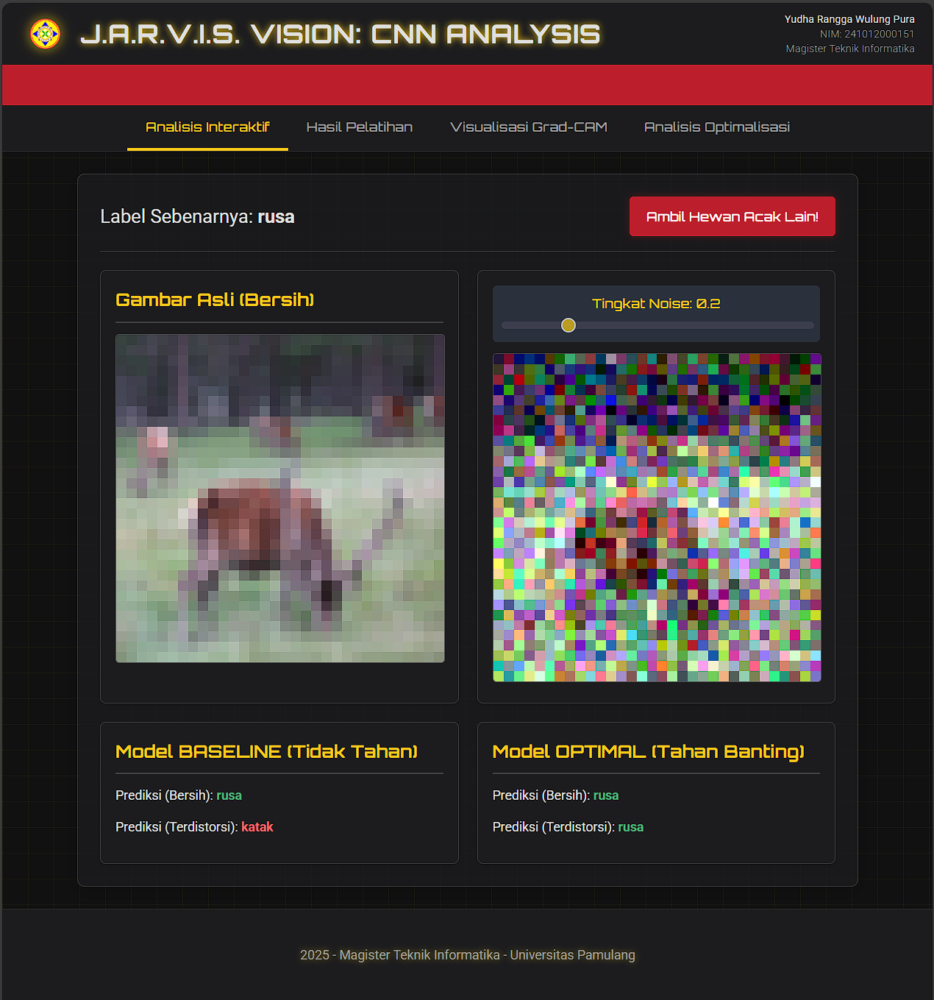
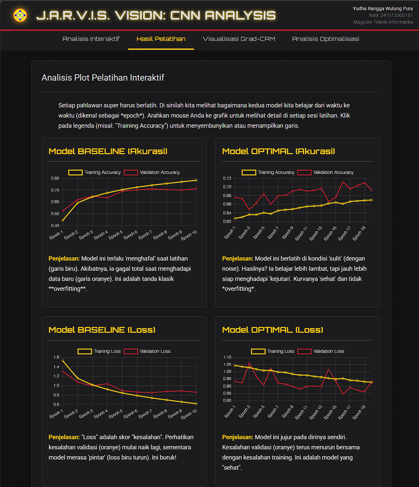
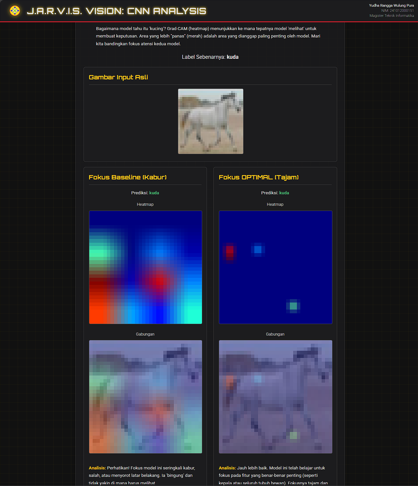
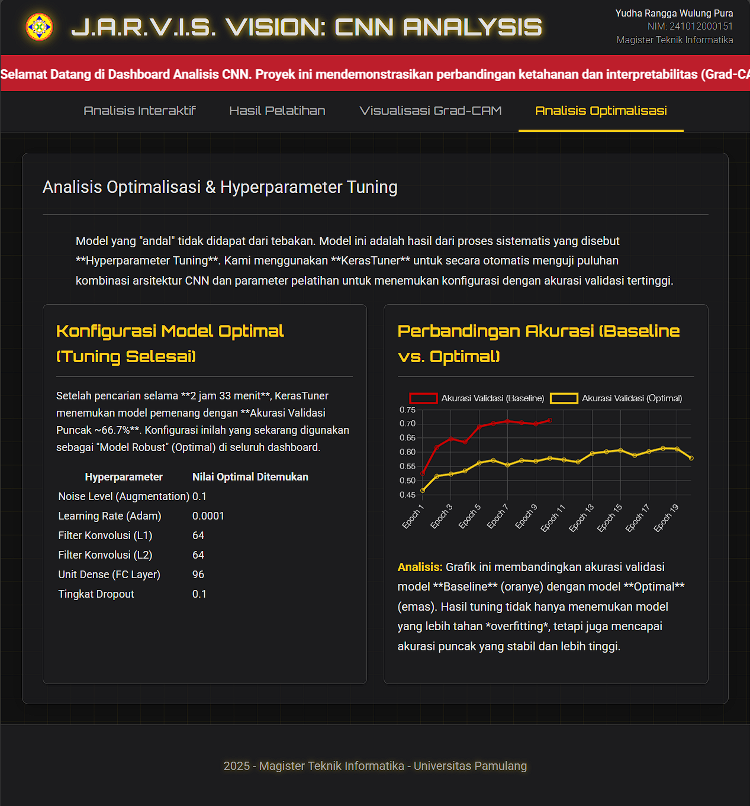

# Proyek: J.A.R.V.I.S. VISION 🤖
**Dashboard Analisis Kinerja, Ketahanan, dan Optimalisasi CNN**

Repositori ini berisi kode sumber untuk *dashboard* web interaktif yang dibuat dengan **Flask** dan **TensorFlow/Keras**, dengan tema "J.A.R.V.I.S.". Aplikasi ini mendemonstrasikan analisis mendalam model *Convolutional Neural Network* (CNN) untuk klasifikasi gambar.

Proyek ini tidak hanya membandingkan model 'Baseline' dengan model 'Optimal', tetapi juga secara sistematis **menemukan model optimal** tersebut menggunakan **KerasTuner** dan membuktikan keunggulannya melalui visualisasi **Grad-CAM**.

**Diajukan untuk memenuhi Tugas Praktikum Mata Kuliah Advanced Computer Vision.**
**Nama:** Yudha Rangga Wulung Pura
**NIM:** 241012000151
**Institusi:** Magister Teknik Informatika - Universitas Pamulang

---

### 📸 Tampilan Aplikasi (Tema: J.A.R.V.I.S. VISION)

| Analisis Interaktif (Slider Noise) | Hasil Pelatihan (Chart.js) |
| :---: | :---: |
|  |  |
| **Visualisasi Grad-CAM (XAI)** | **Analisis Optimalisasi (KerasTuner)** |
|  |  |

---

### 🚀 Fitur Utama

Aplikasi ini dibagi menjadi empat tab analisis utama:

1.  **Analisis Interaktif:**
    * Memungkinkan pengguna mengontrol tingkat *Gaussian noise* secara interaktif menggunakan **slider**.
    * Membandingkan secara *real-time* (via **AJAX**) bagaimana model *Baseline* (rentan) gagal sementara model *Optimal* (tahan banting) berhasil.

2.  **Hasil Pelatihan:**
    * Visualisasi plot *loss* dan *accuracy* yang interaktif (ditenagai **Chart.js**) dari kedua model.
    * Menampilkan bukti kuantitatif *overfitting* pada model *Baseline* dan bagaimana model *Optimal* mengatasinya.

3.  **Visualisasi Grad-CAM:**
    * Fitur **Explainable AI (XAI)** untuk "melihat ke dalam" pikiran model.
    * Menampilkan perbandingan **peta panas (heatmap)** Grad-CAM berdampingan, membuktikan *mengapa* model *Optimal* lebih baik dengan menunjukkan fokus atensinya yang superior.

4.  **Analisis Optimalisasi:**
    * Menampilkan hasil dari proses **Hyperparameter Tuning** otomatis menggunakan **KerasTuner**.
    * Menyajikan tabel konfigurasi "pemenang" (arsitektur & parameter) yang digunakan untuk membuat **Model Optimal**.

---

### 🔧 Cara Menjalankan Proyek Ini (Lokal)

1.  **Clone repositori ini:**
    ```bash
    git clone [https://github.com/yudharangga-hub/Proyek_Analisis_CNN_CIFAR10_YudhaRWP_UNPAM.git](https://github.com/yudharangga-hub/Proyek_Analisis_CNN_CIFAR10_YudhaRWP_UNPAM.git)
    cd Proyek_Analisis_CNN_CIFAR10_YudhaRWP_UNPAM
    ```

2.  **Buat virtual environment (Direkomendasikan):**
    ```bash
    python -m venv venv
    source venv/bin/activate  # Di Windows: venv\Scripts\activate
    ```

3.  **Instal semua library yang dibutuhkan:**
    ```bash
    pip install -r requirements.txt
    ```

4.  **(PENTING) Latih Model & Jalankan Tuning:**
    Model `.h5` dan data `.json` tidak disimpan di repositori. Jalankan skrip ini **satu kali** untuk melatih model *Baseline* dan menjalankan proses *tuning* KerasTuner untuk menemukan & menyimpan model *Optimal*.
    
    **(Peringatan: Proses ini bisa memakan waktu beberapa jam.)**
    ```bash
    python main_project.py
    ```

5.  **Jalankan aplikasi Flask:**
    ```bash
    flask run
    ```

6.  Buka browser Anda dan kunjungi `http://127.0.0.1:5000`

---

### 📂 Struktur Folder Proyek

```text
Proyek_Analisis_CNN_CIFAR10_YudhaRWP_UNPAM/
│
├── app.py                   # Logika server Flask (Backend)
├── main_project.py          # Skrip pelatihan & tuning KerasTuner (Offline)
├── requirements.txt         # Daftar library Python
├── .gitignore               
├── README.md                # Dokumentasi ini
│
├── models/                  # (Dibuat oleh main_project.py)
│   ├── baseline_cnn_cifar10.h5
│   └── optimal_cnn_cifar10.h5
│
├── keras_tuner_dir/         # (Dibuat oleh main_project.py)
│   └── (Hasil log KerasTuner)
│
├── screenshots/             # (Gambar demo untuk README)
│   ├── demo-01-interaktif.png
│   └── ...
│
├── static/
│   ├── css/
│   │   └── style.css        # File CSS Tema Iron Man
│   ├── images/
│   │   └── logo_unpam.png
│   ├── baseline_history.json  # (Dibuat oleh main_project.py)
│   └── optimal_history.json   # (Dibuat oleh main_project.py)
│
└── templates/
    ├── base.html            # Layout induk
    ├── index.html           # Tab 1
    ├── training_results.html  # Tab 2
    ├── feature_maps.html      # Tab 3
    └── optimization.html      # Tab 4